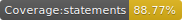
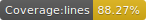

# Heaven Festival

A demo fullstack app that you can use as a template for building a site for a festival.

[](http://commitizen.github.io/cz-cli/)
[](https://github.com/pamepeixinho/jest-coverage-badges)
[](https://github.com/pamepeixinho/jest-coverage-badges)
[](https://github.com/pamepeixinho/jest-coverage-badges)
[](https://david-dm.org/Ziv-Barber/festival-example)
[](https://david-dm.org/Ziv-Barber/festival-example#info&#x3D;devDependencies)
[](https://github.com/prettier/prettier)
[](https://github.com/semantic-release/semantic-release)


[Live example in Heroku](https://quiet-dawn-70139.herokuapp.com/)

- [Getting Started](#getstart)
- [External dependencies](#dependencies)
- [Installation](#inst)
- [The source code](#code)
- [Credit](#credit)

<a name="getstart"></a>
## Getting Started: ##

- [**Commands**](docs/general/commands.md): Getting the most out of this project.

<a name="dependencies"></a>
## External dependencies: ##

This project is using the following awesome libraries/utilities/services:

- [babel 7](https://babeljs.io/)
- [better-npm-run](https://github.com/benoror/better-npm-run)
- [commitizen](http://commitizen.github.io/cz-cli)
- [ESDoc](https://esdoc.org/)
- [ESLint](https://eslint.org/)
- [flow](https://flow.org/)
- [Immutable.js](https://facebook.github.io/immutable-js/)
- [redux-immutable](https://github.com/gajus/redux-immutable)
- [jest](https://jestjs.io/)
- [npm-run-all](https://github.com/mysticatea/npm-run-all)
- [Prettier](https://prettier.io/)
- [react](https://reactjs.org/)
- [react-hot-loader](https://github.com/gaearon/react-hot-loader)
- [react-testing-library](https://github.com/kentcdodds/react-testing-library)
- [redux](https://redux.js.org/)
- [semantic-release](https://github.com/semantic-release/semantic-release)
- [webpack](https://webpack.js.org/)

<a name="inst"></a>
## Installation: ##

via Git:

```bash
$ git clone git://github.com/Ziv-Barber/festival-example.git
```

<a name="code"></a>
## :coffee: The source code: ##

### More documentations: ###

- [**The Hitchhikers Guide to `react-boilerplate`**](docs/general/introduction.md): An introduction for the original boilerplate used for this project.
- [Overview](docs/general): A short overview of the included tools.
- [**Troubleshooting**](docs/general/gotchas.md): Solutions to common problems faced by developers.

<a name="credits"></a>
## Credit: ##

- Created by Ziv Barber on the top of react-boilerplate, created by <a href="https://twitter.com/mxstbr">Max Stoiber</a> and maintained with ❤️ by an amazing <a href="https://github.com/orgs/react-boilerplate/teams/core">team of developers</a>.


